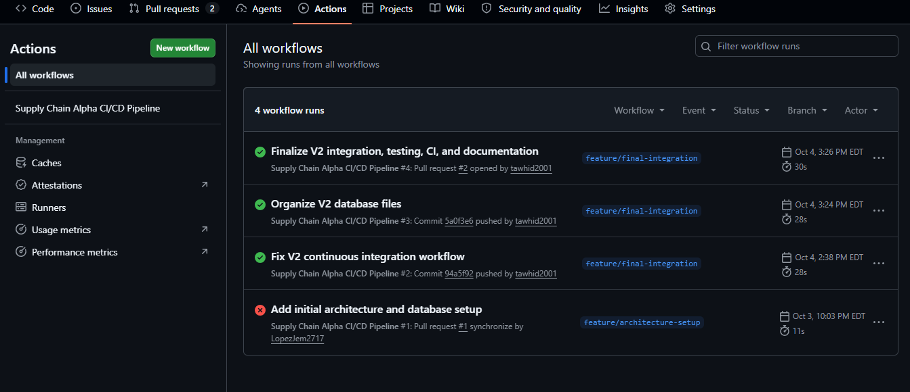

# CI/CD Evidence

## Purpose

The project uses GitHub Actions to verify that the integrated Node and Python components can execute in a clean automated environment. This reduces dependence on one developer's local configuration and provides repeatable integration evidence.

## Workflow

Workflow file:

```text
.github/workflows/ci-cd_v2.yml
```

The workflow runs on pushes to `main` and `feature/final-integration`, and on pull requests targeting `main`.

## Automated Pipeline Steps

The current workflow performs the following actions:

1. Checks out the repository.
2. Configures Node.js 20.
3. Runs `npm ci` in `backend/node-api`.
4. Starts `server.js` and waits briefly for the API.
5. Runs the V2 API integration tests with `npm test`.
6. Configures Python 3.13.
7. Executes `backend/python-service/Simulator_v2.py`.

## Integration Test Coverage

`tests/test_api_v2.js` performs five automated checks:

1. `GET /api/health` returns HTTP 200.
2. `GET /api/shipments` returns HTTP 200.
3. `GET /api/shipments/TRK-1001` successfully retrieves an existing shipment.
4. `GET /api/shipments/TRK-9999` returns HTTP 404.
5. `PUT /api/shipments/TRK-1001/telemetry` successfully updates shipment telemetry.

A successful test run ends with `All V2 API integration tests passed.`

## CI Improvement Evidence

During final integration, the project initially had a failed workflow. The V2 test setup and CI configuration were then corrected. The GitHub Actions history captured for the final presentation shows the progression from the earlier failed architecture/database workflow to three consecutive successful `feature/final-integration` runs:

- `Fix V2 continuous integration workflow` — successful.
- `Organize V2 database files` — successful.
- `Finalize V2 integration, testing, CI, and documentation` — successful.

This sequence provides evidence of an iterative integration process: identify failure, correct the configuration, and verify the correction repeatedly in GitHub's hosted environment.

## CI Screenshot



The screenshot above is the CI evidence used in the stakeholder presentation.

## Deployment Status

The repository and CI pipeline verify the application and its integration, but the materials reviewed for this final documentation do **not** establish a production/public deployment. The application is demonstrated locally on `localhost:3000`. Therefore, this documentation does not claim a deployment screenshot or production deployment.

If the course requires a deployment screenshot specifically for the highest rubric level, that remains a separate artifact to add only after an actual deployment has been completed and verified.
